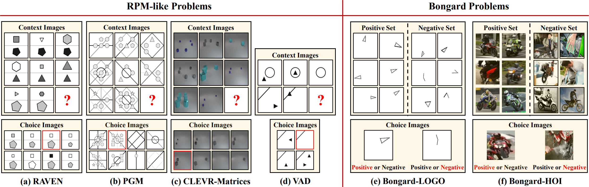
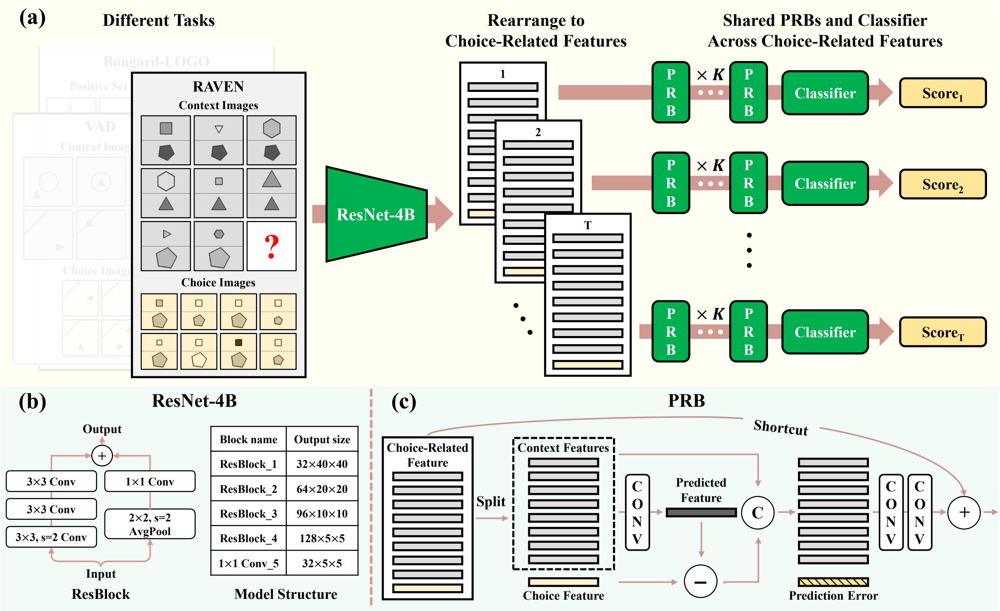

## Neural Prediction Errors as A Unified Cue for Abstract Visual Reasoning (T-PAMI 2025)
[**Lingxiao Yang**](https://zjjconan.github.io/), [Xiaohua Xie](http://cse.sysu.edu.cn/content/2478), [Wei-Shi Zheng](https://www.isee-ai.cn/~zhwshi/), [Fang Fnag](https://www.psy.pku.edu.cn/english/people/faculty/professor/fangfang/index.htm), [Ru-Yuan Zhang](https://ruyuanzhang.github.io/)

This new paper extends our ICML 2023 publication, "Neural Prediction Errors Enable Analogical Visual Reasoning in Human Intelligence Tests", offering a broader framework for supervised and self-supervised learning.

## Highlights

**<p align="justify"> Abstract:** Humans exhibit remarkable abilities in recognizing relationships and performing complex reasoning. In contrast, deep neural networks have long been critiqued for their limitations in abstract visual reasoning (AVR), a key challenge in achieving artificial general intelligence. Drawing on the well-known concept of prediction errors from neuroscience, we propose that prediction errors can serve as a unified mechanism for both supervised and self-supervised learning in AVR. In our novel supervised learning model, AVR is framed as a prediction-and-matching process, where the central component is the discrepancy (*i.e.*, prediction error) between a predicted feature based on abstract rules and candidate features within a reasoning context. In the self-supervised model, prediction errors as a key component unify the learning and inference processes. Both supervised and self-supervised prediction-based models achieve state-of-the-art performance on a broad range of AVR datasets and task conditions. Most notably, hierarchical prediction errors in the supervised model automatically decrease during training, an emergent phenomenon closely resembling the decrease of dopamine signals observed in biological learning. These findings underscore the critical role of prediction errors in AVR and highlight the potential of leveraging neuroscience theories to advance computational models for high-level cognition in artificial intelligence. The code is available at https://github.com/ZjjConan/AVR-PredRNet. </p>


## Contributions

- We propose a new self-supervised learning framework for AVR, termed SSPredRNet, where predictive error (PE) is exploited as the key signal to construct training samples and support inference in novel reasoning tasks. <p></p>
- We are, to the best of our knowledge, the first to unify supervised and self-supervised AVR under the neuroscience-inspired principle of PE. <p></p>
- We conduct extensive comparisons with state-of-the-art
self-supervised methods. <p></p>
- We further evaluate both PredRNet and SSPredRNet on natural image datasets. <p></p>
- Comprehensive results on **19** benchmark datasets confirm that our models achieve leading performance across diverse machine learning evaluation protocols. <p></p>


## Paper Outlines

### Problem Setting

<p align="center">

</p>

An illustration of two type of AVR problems used in this study from different datasets: the RPM-like problems from (1) the 16-images-based RAVEN-type problems, including RAVEN, PGM and CLEVR-Matrices, and (2) the 9-images-based VAD problems, and the Bongard problems from Bongard-LOGO and Bongard-HOI datasets. In each RPM-like problem as shown in (a) - (d), a few context images are provided. The goal is to choose the correct one (highlighted in red) from the provided choice images to fill in the missing one (denoted by ?), making rows or columns with similar patterns. The Bongard problems in (e) and (f) provide two different sets: one is positive set containing similar patterns, and the other one is negative set with different patterns. Methods should classify which set is belong to for the two provided choice images. Obviously, for all tasks, a subject should recognize diverse visual objects and their attributes, and then discover relationships among these objects for inference.


### Our PredRNet

<p align="center">

</p>

The architecture of PredRNet, illustrated in the figure above, comprises three core components: (1) an **Image Encoder**, which projects each input image into a high-dimensional feature space; (2) a series of K (≥2) stacked **Predictive Reasoning Blocks (PRBs)**, which iteratively model the relational dynamics between context and candidate answer representations; and (3) a **Classifier**, which generates a compatibility score for each of the eight candidate answers. During inference, the model selects the answer with the highest predicted score as the final solution for the given Raven's Progressive Matrix (RPM) problem.


### Our SSPredRNet

<p align="center">

</p>

The core of SSPredRNet is its Sample Construction module, visualized above. AVR problems often contain correct rules within their context images, e.g., the first two rows in a RAVEN problem. Therefore, replacing any context image will largely disrupt these rules, resulting in samples with incorrect rules. Since different tasks have different prior structures, we provide different sample construction methods, from (a) to (c). Features colored in lightgrey are not used during the training phase to avoid including correct rules as negative samples for optimization. Although there are slight differences in the construction methods, our central idea remains the same: disrupting contextual information to generate positive and negative errors for contrastive learning.


Code environments and toolkits
-----------

- OS: Ubuntu 18.04.5
- CUDA: 11.0
- Python: 3.9.16
- Toolkit: PyTorch 1.12.1+cu102
- 4x GPU: 1080 Ti or above
- [thop](https://github.com/Lyken17/pytorch-OpCounter)


Experiments
----------

### Dataset Structure

Please prepare datasets with the following structure:


```markdown
your_dataset_root_dir/

    ├─I-RAVEN (RAVEN or RAVEN-FAIR)
    │  ├─center_single
    │  ├─distribute_four
    │  ├─distribute_nine
    │  ├─in_center_single_out_center_single
    │  ├─in_distribute_four_out_center_single
    │  ├─left_center_single_right_center_single
    │  └─up_center_single_down_center_single
    ├─PGM
    │  └─neutral
    |  └─interpolation
    |  └─extrapolation
    |  └─... (other sub-datasets)
    └─Analogy (VAD)
    │  └─interpolation
    |  └─extrapolation
    |  └─novel.domain.transfer
    |  └─... (other sub-datasets)
    ├─CLEVR-Matrix
    │  ├─problem1
    │  ├─problem2
    │  └─problem3
```

### Training and Evaluation


```python
# Example for training supervised PredRNet and self-supervised SSPredRNet models

python main.py --dataset-name "dataset_name" --dataset-dir "your_dataset_root_dir" --gpu 0,1,2,3 --fp16 \
               --image-size 80 --epochs 100 --seed 12345 --batch-size 128 --lr 0.001 --wd 1e-5 \
               -a predrnet_raven --num-extra-stages 3 --block-drop 0.1 --classifier-drop 0.1 \
               --ckpt ckpts/

python main_ssl.py --dataset-name "dataset_name" --dataset-dir "your_dataset_root_dir" --gpu 0,1,2,3 --fp16 \
               --image-size 80 --epochs 100 --seed 12345 --batch-size 128 --lr 0.001 --wd 1e-5 \
               -a sspredrnet_raven --num-extra-stages 3 --block-drop 0.1 --c-margin 0.7 \
               --ckpt ckpts/

```

```python
# Example for evaluating models

python main.py --dataset-name "dataset_name" --dataset-dir your_dataset_root_dir --gpu 0,1,2,3 \
               --image-size 80 -a predrnet_raven --num-extra-stages 3 \
               -e --resume your_checkpoint_dir/model_best.pth.tar \

python main.py --dataset-name "dataset_name" --dataset-dir your_dataset_root_dir --gpu 0,1,2,3 \
               --image-size 80 -a sspredrnet_raven --num-extra-stages 3 \
               -e --resume your_checkpoint_dir/model_best.pth.tar \

# using "--show-detail" to present detailed results for each configuration on RAVENs
```

More running commands can be found in "script_train.sh" and "script_eval.sh" scripts.


#### Updated results on RAVEN (RVN-O), Impartial-RAVEN (I-RVN), RAVEN-FAIR (RVN-F) and PGM-Neural (PGM-N)

The new state-of-the-art results reported in our T-PAMI paper are achieved with several key hyperparameter refinements, including setting classifier-drop to 0.1 and enabling row- and column-wise relational reasoning (enable-rc) for the PGM datasets. 


<small>


| Method | SCL  | Rel-Base | MRNet |STSN  | DRNet    | **PredRNet** | **SSPredRNet** |
|:---:   |:---: |:---:     |:---:  |:---: |:---:     |:---:         | :---:          |
|        | SL   | SL       | SL    | SL   | SL       | SL           | SSL            |
| PGM-N  | 88.9 | 85.5     | 94.5  | 98.2 | **99.1** | **99.1**     | 64.9           |
| RVN-O  | 91.6 | 91.7     | 96.6  | 89.7 | **96.9** | 96.7         | 57.1           |
| RVN-F  | 90.1 | 93.5     | 88.4  | 95.4 | 97.6     | **97.9**     | 66.5           |
| I-RVN  | 95.0 | 91.1     | 83.5  | 95.7 | 97.1     | **97.2**     | 62.3           |
| Avg    | 91.4 | 90.5     | 90.8  | 94.8 | **97.7** | **97.7**     | 62.7           |

</small>

#### Updated results on all sub-datasets of PGM

**Ntr**: Neutral, **Int**: Interpolation, **Ext**: Extrapolation, **H.O**: Held-Out, **P**: Pairs, **TP**: TriplePairs, **LT**: LineType, **SC**: ShapeColor

<small>

|Method    | Ntr  | Int  | Ext  | H.O.P | H.O.TP | H.O.T | H.O.LT | H.O.SC | Avg  |
|:---:     |:---: |:---: |:---: |:---:  |:---:   |:---:  |:---:   |:---:   |:---: |
| WReN     | 62.6 | 64.4 | 17.2 | 27.2  | 41.9   | 19.0  | 14.4   | 12.5   | 32.4 |
| MXGNet   | 66.7 | 65.4 | 18.9 | 33.6 | 43.3 | 19.9 | 16.7 | 16.6 | 35.1 |
| MRNet    | 93.4 | 68.1 | 19.2 | 38.4 | 55.3 | 25.9 | 30.1 | **16.9** | 43.4 | 
| ARII     | 88.0 | 72.0 | **29.0** | 50.0  | 64.1 | 32.1 | 16.0 | 12.7 | 45.4 |
| DRNet    | **99.1** | **83.8** | 22.2 | 93.7 | 78.1 | **48.8** | 27.9 | 13.1 | 58.3 |
| **PredRNet** | **99.1** | 75.3 | 22.9 | **99.3** | **98.9** | 41.2 | **33.4** | 13.1 | **60.4** |
| **SSPredRNet** | 64.9 | 51.8 | 17.0 | 32.3 | 41.9 | 23.7 | 20.4 | 12.7 | 33.1 |

</small>

--------------------------------------------------------------------

#### For an in-depth comparison of PredRNet and SSPredRNet, including ablation studies and detailed results, please refer to our T-PAMI paper.

Citation
--------
If you find this code useful in your research, please consider citing:

    @InProceedings{PredRNet-ICML23,
      title = 	 {Neural Prediction Errors enable Analogical Visual Reasoning in Human Standard Intelligence Tests},
      author =       {Yang, Lingxiao and You, Hongzhi and Zhen, Zonglei and Wang, Dahui and Wan, Xiaohong and Xie, Xiaohua and Zhang, Ru-Yuan},
      booktitle = 	 {Proceedings of the 40th International Conference on Machine Learning},
      pages = 	 {39572--39583},
      year = 	 {2023},
      editor = 	 {Krause, Andreas and Brunskill, Emma and Cho, Kyunghyun and Engelhardt, Barbara and Sabato, Sivan and Scarlett, Jonathan},
      volume = 	 {202},
      series = 	 {Proceedings of Machine Learning Research},
      month = 	 {23--29 Jul},
      publisher =    {PMLR},
      pdf = 	 {https://proceedings.mlr.press/v202/yang23r/yang23r.pdf},
      url = 	 {https://proceedings.mlr.press/v202/yang23r.html}
    }


    @ARTICLE{PredRNet-TPAMI25,
      author={Yang, Lingxiao and Xie, Xiaohua and Zheng, Wei-Shi and Fang, Fang and Zhang, Ru-Yuan},
      journal={IEEE Transactions on Pattern Analysis and Machine Intelligence}, 
      title={Neural Prediction Errors as A Unified Cue for Abstract Visual Reasoning}, 
      year={2025},
      volume={},
      number={},
      pages={1-17},
      keywords={Cognition; Visualization; Predictive models; Biological system modeling; Computational modeling; Training; Neuroscience; Supervised learning; Observers; Brain modeling; Neural Prediction Errors; Analogical Visual Reasoning; Intelligence Tests; RPM-like; Bongard Problem},
      doi={10.1109/TPAMI.2025.3623461}
    }


## Contact Information

If you have any suggestion or question, you can contact us by: lingxiao.yang717@gmail.com. Thanks for your attention!
