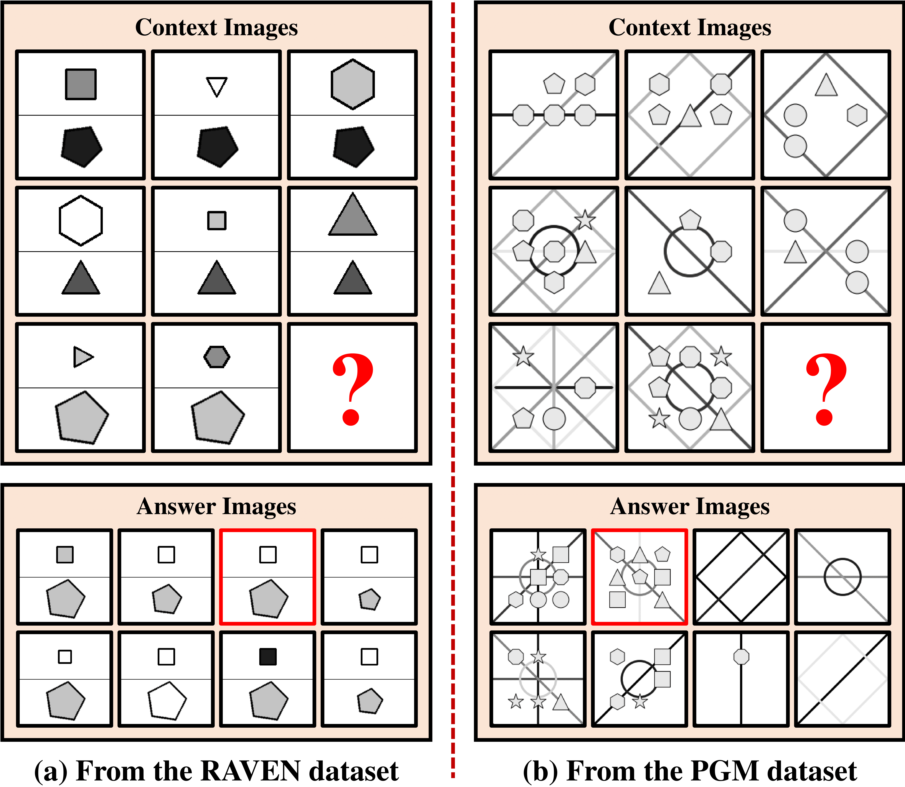

## Neural Prediction Errors enable Analogical Visual Reasoning in Human Standard Intelligence Tests
[**Lingxiao Yang**](https://zjjconan.github.io/), [Hongzhi You](https://scholar.google.com.hk/citations?user=-YrT4k0AAAAJ&hl=en), [Zonglei Zhen](http://bnupsych.bnu.edu.cn/tabid/324/ArticleID/6360/frtid/307/Default.aspx), [Da-Hui Wang](https://sss.bnu.edu.cn/en/Faculty/Professor/940511f27b0546349ba1b6ed8573b20e.htm), [Xiaohong Wan](https://brain.bnu.edu.cn/English/Faculty/CurrentFaculty/Wzz/5570ea01d6274fd0b2aeafe0ed86910b.htm), [Xiaohua Xie](http://cse.sysu.edu.cn/content/2478), [Ru-Yuan Zhang](https://ruyuanzhang.github.io/)

Abstract
----------
Deep neural networks have long been criticized for lacking the ability to perform analogical visual reasoning. Here, we propose a neural network model to solve Raven's Progressive Matrices (RPM) - one of the standard intelligence tests in human psychology. Specifically, we design a reasoning block based on the well-known concept of prediction error (PE) in neuroscience. Our reasoning block uses convolution to extract abstract rules from high-level visual features of the 8 context images and generates the features of a predicted answer. PEs are then calculated between the predicted features and those of the 8 candidate answers, and are then passed to the next stage. We further integrate our novel reasoning blocks into a residual network and build a new Predictive Reasoning Network (PredRNet). Extensive experiments show that our proposed PredRNet achieves state-of-the-art average performance on several important RPM benchmarks. PredRNet also shows good generalization abilities in a variety of out-of-distribution scenarios and other visual reasoning tasks. Most importantly, our PredRNet forms low-dimensional representations of abstract rules and minimizes hierarchical prediction errors during model training, supporting the critical role of PE minimization in visual reasoning. Our work highlights the potential of using neuroscience theories to solve abstract visual reasoning problems in artificial intelligence. The code is available at https://github.com/ZjjConan/AVR-PredRNet.

--------------------------------------------------

Our environments and toolkits
-----------

- OS: Ubuntu 18.04.5
- CUDA: 11.0
- Python: 3.9.16
- Toolkit: PyTorch 1.12.1+cu102
- 4x GPU: 1080 Ti or above
- [thop](https://github.com/Lyken17/pytorch-OpCounter)


RPM Problem Setting
------

The goal of each RPM is to choose the correct one (highlighted in red) from eight answer images to fill in the missing one (denoted by ?), making three rows or three columns with similar patterns. Obviously, a subject should recognize diverse visual objects, and then discover abstract relationships among these objects for inference.

<p align="center">

</p>


Our PredRNet
------

The structure of our PredRNet is shown in above. It consists of three components: (1) an **Image Encoder** to transform each image into a 3-dimensional high-level representation (features), (2) multiple (K ≥ 2) stacked **Predictive Reasoning Block (PRB)** to extract relationships between the representations of context and answer images, and (3) a **Classifier** to output the scores for 8 answer images. In each RPM, the answer image with the highest score is selected as the final answer.

<p align="center">

</p>


Experiments
----------

### Dataset Structure

Please prepare datasets with following structure:


```markdown
your_dataset_root_dir/

    ├─I-RAVEN (RAVEN or RAVEN-FAIR)
    │  ├─center_single
    │  ├─distribute_four
    │  ├─distribute_nine
    │  ├─in_center_single_out_center_single
    │  ├─in_distribute_four_out_center_single
    │  ├─left_center_single_right_center_single
    │  └─up_center_single_down_center_single
    ├─PGM
    │  └─neutral
    |  └─interpolation
    |  └─extrapolation
    |  └─... (other sub-datasets)
    └─Analogy (VAD)
    │  └─interpolation
    |  └─extrapolation
    |  └─novel.domain.transfer
    ├─CLEVR-Matrix
    │  ├─problem1
    │  ├─problem2
    │  └─problem3
```

### Training and Evaluation


```python
# Example for training models

python main.py --dataset-name I-RAVEN --dataset-dir "your_dataset_root_dir" --gpu 0,1,2,3 --fp16 \
               --image-size 80 --epochs 100 --seed 12345 --batch-size 128 --lr 0.001 --wd 1e-5 \
               -a predrnet_raven --num-extra-stages 3 --block-drop 0.1 --classifier-drop 0.1 \
               --ckpt ckpts/

```

```python
# Example for evaluating models

python main.py --dataset-name I-RAVEN --dataset-dir your_dataset_root_dir --gpu 0,1,2,3 \
               --image-size 80 -a predrnet_raven --num-extra-stages 3 \
               -e --resume your_checkpoint_dir/model_best.pth.tar \

# using "--show-detail" to present detailed results for each configuration on RAVENs
```

#### Results on RAVEN (RVN-O), Impartial-RAVEN (I-RAVEN), RAVEN-FAIR (RAVEN-F) and PGM-Neural (PGM-N)

<small>

| Method | SCL  | Rel-Base | MRNet |STSN  | **PredRNet** |
|:---:   |:---: |:---:     |:---:  |:---: |:---:     |
| PGM-N  | 88.9 | 85.5     | 94.5  | **98.2** | 97.4     |
| RVN-O  | 91.6 | 91.7     | **96.6**  | 89.7 | 95.8     | 
| RVN-F  | 90.1 | 93.5     | 88.4  | 95.4 | **97.1**     |
| I-RVN  | 95.0 | 91.1     | 83.5  | 95.7 | **96.5**     |
| Avg    | 91.4 | 90.5     | 90.8  | 94.8 | **96.7**     |

</small>

#### Results on All Sub-datasets of PGM

**Ntr**: Neutral, **Int**: Interpolation, **Ext**: Extrapolation, **H.O**: Held-Out, **P**: Pairs, **TP**: TriplePairs, **LT**: LineType, **SC**: ShapeColor

<small>

|Method    | Ntr  | Int  | Ext  | H.O.P | H.O.TP | H.O.T | H.O.LT | H.O.SC | Avg  |
|:---:     |:---: |:---: |:---: |:---:  |:---:   |:---:  |:---:   |:---:   |:---: |
| WReN     | 62.6 | 64.4 | 17.2 | 27.2  | 41.9   | 19.0  | 14.4   | 12.5   | 32.4 |
| MXGNet   | 66.7 | 65.4 | 18.9 | 33.6 | 43.3 | 19.9 | 16.7 | 16.6 | 35.1 |
| MRNet    | 93.4 | 68.1 | 19.2 | 38.4 | 55.3 | **25.9** | **30.1** | **16.9** | 43.4 | 
| PredRNet | **97.4** | **70.5** | **19.7** | **63.4** | **67.8** | 23.4 | 27.3 | 13.1 | **47.1** |

</small>

--------------------------------------------------------------------

#### More detailed results can be found in our ICML paper.

Citation
--------
If you find our **PredRNet** useful in your research, please consider citing (not available now):


## Contact Information

If you have any suggestion or question, you can contact us by: lingxiao.yang717@gmail.com. Thanks for your attention!